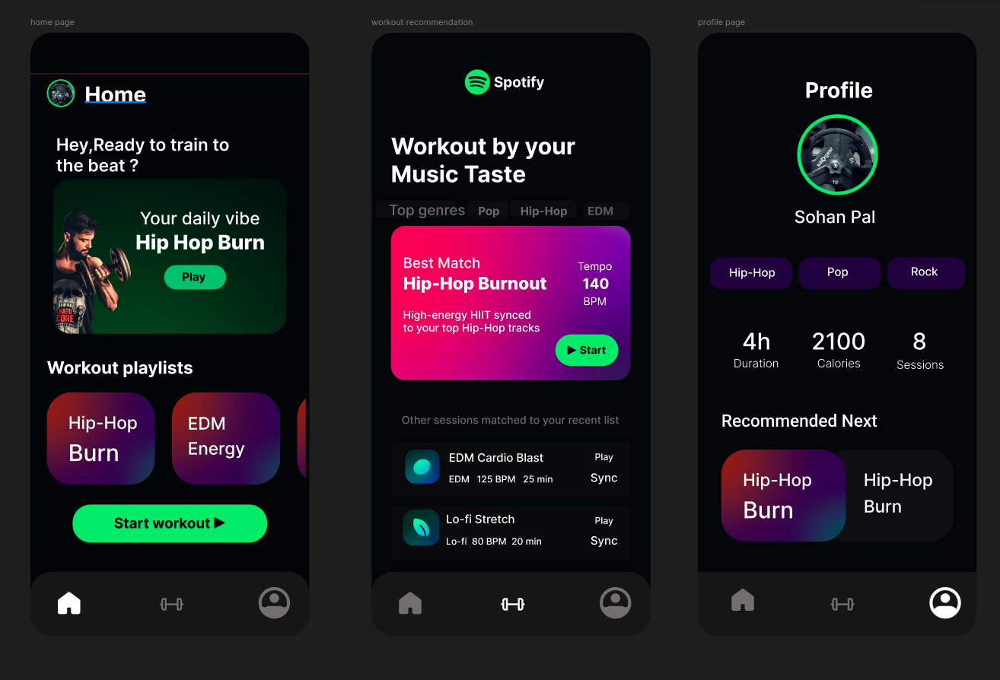

# Sohan Pal — UX & Visual Design Portfolio ✦

A premium, highly polished, and interactive portfolio built for showcasing UI/UX case studies, visual design, branding, and motion graphics. Designed with a focus on rich aesthetics, smooth micro-interactions, and flawless typography.



---

## ✨ Key Features

* 🎨 **Dynamic Aesthetics & Branding:** Built with curated OKLCH color spaces, smooth gradients, glassmorphic UI components, and custom typography.
* ⚡ **Lightning Fast & Responsive:** Powered by Vite, React 18, and TanStack Router for instant page transitions and optimal performance across all devices.
* 🔗 **Flexible Project Showcases:** Supports deep internal case study pages (`/work/$slug`) as well as direct external links to Behance, Dribbble, or Notion presentations.
* 📬 **Live Contact Integration:** Fully functional, serverless contact form integrated with **Web3Forms** that delivers messages instantly to Gmail.
* 📁 **Centralized Content Management:** Entire site content (projects, bio, experience, skills, socials) is cleanly organized in simple TypeScript data files for effortless updating.

---

## 🛠️ Tech Stack

* **Framework:** [React 18](https://react.dev/) + [Vite](https://vitejs.dev/)
* **Language:** [TypeScript](https://www.typescriptlang.org/)
* **Routing:** [TanStack Router](https://tanstack.com/router/latest)
* **Styling:** [Tailwind CSS](https://tailwindcss.com/) + Custom CSS (`oklch` design tokens)
* **Motion & Animation:** [Framer Motion](https://www.framer.com/motion/)
* **Icons:** [Lucide React](https://lucide.dev/) + Custom SVGs
* **Form Handling:** [Web3Forms API](https://web3forms.com/)

---

## 📂 Project Structure & Customization

All personal content and site data lives inside the **`src/data/`** directory. You can update your portfolio without touching any core component code:

```text
src/
├── data/
│   ├── profile.ts       # Name, role, location, bio, and hero tagline
│   ├── projects.ts      # Project details, thumbnails, case studies & external links
│   ├── skills.ts        # Categorized creative stack & tools
│   ├── experience.ts    # Timeline of roles, hackathons, and achievements
│   ├── socials.ts       # Social links (Behance, LinkedIn, Dribbble, GitHub, Insta)
│   └── testimonials.ts  # Quotes from collaborators and clients
├── components/          # Reusable UI cards, navbar, footer, and interactive wrappers
├── routes/              # TanStack Router page views (Home, Work, About, Contact)
└── styles.css           # Core styling tokens, utilities, and marquee animations
```

---

## 🚀 Getting Started (Local Development)

### Prerequisites
Make sure you have [Node.js](https://nodejs.org/) installed (v18+ recommended).

### 1. Install Dependencies
```bash
npm install
```

### 2. Start the Development Server
```bash
npm run dev
```
Open [http://localhost:5173](http://localhost:5173) in your browser to view the site.

### 3. Build for Production
```bash
npm run build
```
Generates an optimized, minified bundle in the `dist/` directory ready for deployment on Vercel, Netlify, or GitHub Pages.

---

## 📬 Contact Form Configuration

The contact form in `src/routes/contact.tsx` is fully integrated with [Web3Forms](https://web3forms.com/). Messages are forwarded directly to the configured email address. 
* To update the receiving email or get a new access key, visit Web3Forms and replace `access_key` in the fetch request.

---

## 📄 License

Designed and crafted by Sohan Pal. Open for collaboration and inspiration.
